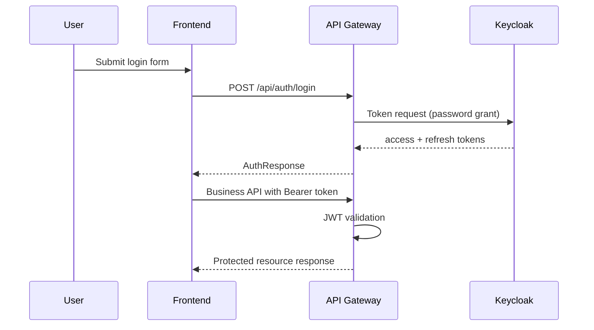

# API Reference

## Public gateway base URL

`http://localhost:8080`

## Authentication API (`/api/auth`)

### `POST /api/auth/register`

Creates user in Keycloak and returns tokens.

Request:

```json
{
  "email": "user@example.com",
  "password": "strongPassword123",
  "firstName": "Ivan",
  "lastName": "Ivanov"
}
```

Response `201`:

```json
{
  "accessToken": "jwt",
  "refreshToken": "jwt",
  "expiresIn": 300,
  "tokenType": "Bearer"
}
```

### `POST /api/auth/login`

Request:

```json
{
  "username": "user@example.com",
  "password": "strongPassword123"
}
```

Response `200`: token payload (same shape as above).

### `POST /api/auth/refresh`

Request:

```json
{
  "refreshToken": "refresh-token"
}
```

Response `200`: new token payload.

### `POST /api/auth/logout`

Request:

```json
{
  "refreshToken": "refresh-token"
}
```

Response `204`.

---

## Business API (`/api`)

All endpoints below require `Authorization: Bearer <accessToken>`.

### Applications

- `POST /api/applications` — create application
- `GET /api/applications/{id}` — get application details
- `POST /api/applications/{id}/submit` — submit for scoring
- `GET /api/applications/{id}/scoring-result` — get scoring result
- `GET /api/applications/{id}/offers` — list offers
- `POST /api/applications/{id}/offers/{offerId}/select` — select offer
- `POST /api/applications/{id}/request-documents` — request documents generation
- `GET /api/applications/{id}/documents` — list generated documents

### Documents

- `GET /api/documents/{documentId}/download` — download generated document

---

## Health endpoints

- `GET /actuator/health` (gateway)
- `GET /application-service/actuator/health`
- `GET /scoring-service/actuator/health`
- `GET /document-service/actuator/health`

---

## Auth sequence diagram


