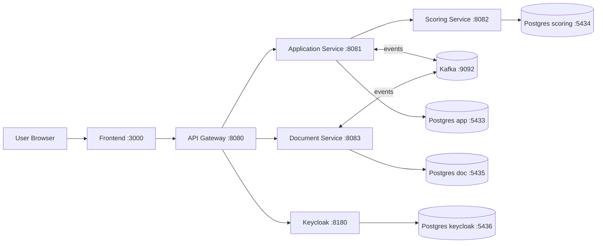

# Credit Calculator — Project Overview

## Goal

Credit Calculator is a microservice web application for:
- credit pre-calculation,
- creating and processing credit applications,
- scoring decision flow,
- generating downloadable documents.

## Architecture

The system consists of:
- `frontend` (React + Vite, port `3000`)
- `api-gateway` (Spring Cloud Gateway, port `8080`)
- `application-service` (port `8081`)
- `scoring-service` (port `8082`)
- `document-service` (port `8083`)
- Keycloak (identity provider, port `8180`)
- Kafka (events, port `9092`)
- PostgreSQL databases (per service)

## User-Facing Authentication Model

The app now uses product-native screens:
- `/login` shows internal application login form,
- `/register` shows internal application registration form.

Frontend sends credentials to gateway endpoint:
- `POST /api/auth/login`
- `POST /api/auth/register`

Gateway communicates with Keycloak on behalf of frontend and returns access/refresh tokens.
As a result, users do not need to interact with Keycloak UI directly.

## Main Flows

1. User registers or signs in from frontend form.
2. Gateway exchanges credentials with Keycloak and returns JWT tokens.
3. Frontend stores tokens and sends `Authorization: Bearer ...` to `/api/**`.
4. Gateway validates JWT and routes requests to microservices.
5. Services process application/scoring/document workflows.

## High-Level Component Diagram

